# DigitalCulturalHeritageUniapp-
非遗文物数字化小程序 系统亮点：AI非遗问答、ONNX图像识别、协同过滤推荐、ECharts数据分析、非遗知识浏览与互动、文创商城订单闭环、文化活动报名签到、社区交流。

所有源码均本人开发，项目是前后端分离的，所有的项目都具备了完整的业务逻辑，不仅仅局限于基础的增删改查（CRUD）操作，系统亮点众多。

本文注重于计算机毕业设计选题指导，列出题目均有源码， 大家可以去【公众号】(毕业终点站)获取或者加我【qq】(2112698948)提意见(别忘记Star哟)。备注：git

声明：仅用于学习使用，请勿用于任何商业行为！

1.系统非商用，非开源，非无偿。

2.由本人开发，如需源码，请联系以下方式，qq:2112698948。

3.项目有很多，并未全部上传，如果未找到想要的，可直接咨询。

# DX6007 非遗文物数字化小程序

> 面向居民用户与管理员的非遗文化数字化服务平台，围绕非遗项目浏览、分类检索、点赞收藏、个性化推荐、AI 问答、图片识别、文化活动、文创商品与社区交流等场景构建服务链路，并提供内容维护、订单处理、活动管理与经营数据分析能力。

## 一、技术架构

| 层级 | 主要技术与职责 |
| :--- | :--- |
| uniapp 用户端 | 提供非遗探索、活动报名、文创商城、社区互动、AI 助手及图像识别等入口。 |
| 管理端 | Vue 3、Element Plus、ECharts、echarts-wordcloud；用于非遗内容、商品订单、活动报名、社区内容、识别记录及运营数据管理。 |
| 服务端 | Spring Boot 3.3.1、Java 17、MyBatis-Plus、MySQL、JWT；提供 REST 接口、身份认证、业务状态流转与数据持久化。 |
| 智能与推荐能力 | LangChain4j 对接 DeepSeek 流式模型、SSE、ONNX Runtime 图像推理、基于用户行为的协同过滤及同类内容推荐。 |

## 二、系统亮点

1. AI非遗问答
2. ONNX图像识别
3. 协同过滤推荐
4. ECharts数据分析
5. 非遗知识浏览与互动
6. 文创商城订单完整链路
7. 文化活动报名签到
8. 社区交流

## 三、核心功能说明

1. **非遗内容浏览、互动与个人轨迹**：以非遗项目为核心，维护分类、地区、级别、传承人及图文影音资料，支持浏览、点赞、收藏并沉淀个人交互数据。
2. **基于 ONNX 模型的非遗图像识别**：服务端 ONNX Runtime 加载识别模型，上传图片推理返回 Top5 标签及匹配非遗条目，并保存识别记录。
3. **基于 DeepSeek 的 AI 非遗智能问答**：LangChain4j 对接 DeepSeek 流式模型，注入非遗提示词，通过 SSE 分段返回「非遗守护者」助手回答。
4. **基于用户行为的个性化非遗推荐**：综合浏览、点赞、收藏构建偏好矩阵，以余弦相似度做协同过滤，并补充同分类热门内容。
5. **文化活动报名、取消与签到**：维护活动状态与名额，支持报名中提交、未签到前取消、活动期间签到并回退人数。
6. **文创商城、库存与订单状态流转**：商品、购物车、订单确认、支付、发货、确认收货与取消全流程，订单创建同步扣减库存。
7. **社区动态、话题与互动管理**：围绕话题发布图文动态、评论与点赞，记录互动数据供运营统一维护。
8. **管理端内容运营与 JWT 身份认证**：区分管理员与普通用户，JWT 解析身份，集中提供内容投放到行为数据维护的运营入口。
9. **运营数据分析与可视化**：ECharts 与词云展示活动、订单、社区统计，以饼图、柱状、折线、仪表盘等辅助运营决策。

## 四、功能模块与截图

> 截图存放于仓库 `images/` 目录，不依赖外部图床。

### 4.0 平台总览

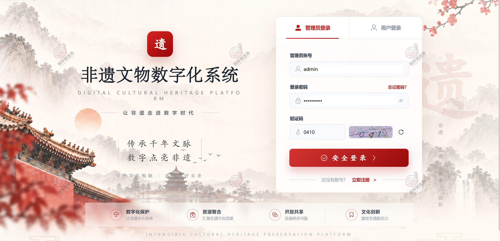

**图 1 · 平台总览**：小程序整体界面概览，涵盖用户端与活动、商城、社区入口。

### 4.1 用户端

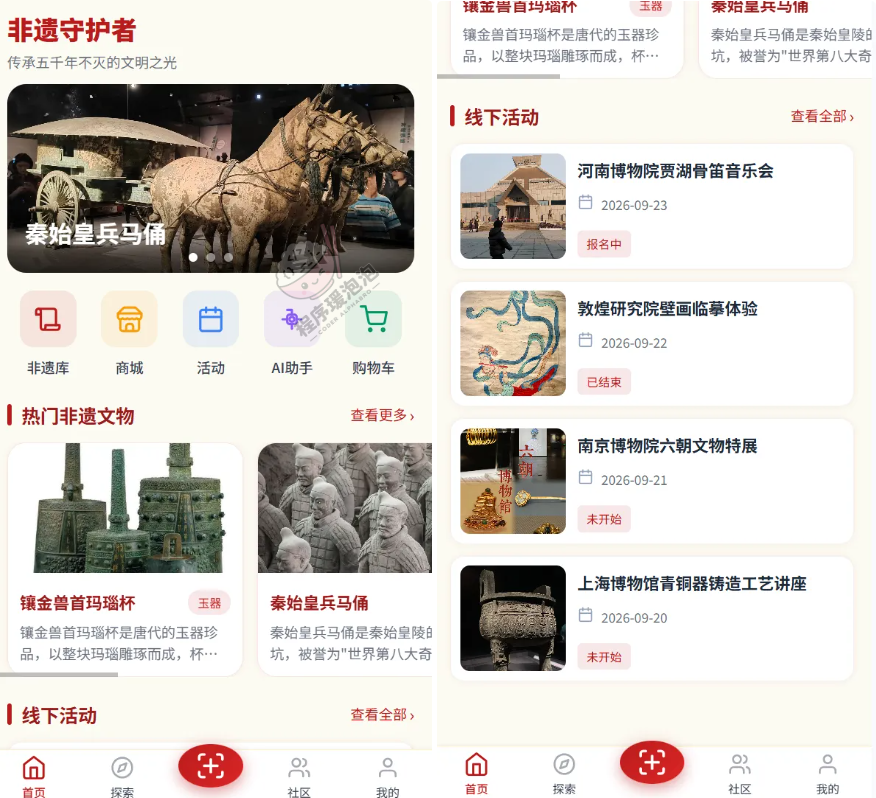

**图 2 · 首页**：非遗探索首页，轮播推荐与热门内容聚合。

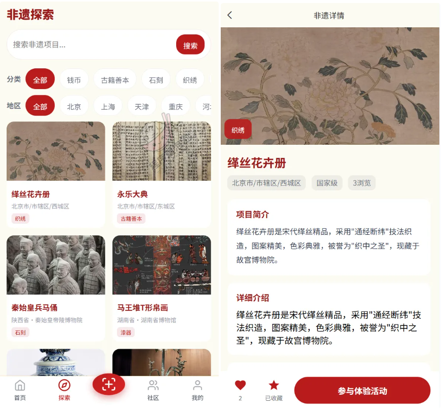

**图 3 · 非遗探索**：非遗项目分类检索与列表浏览。

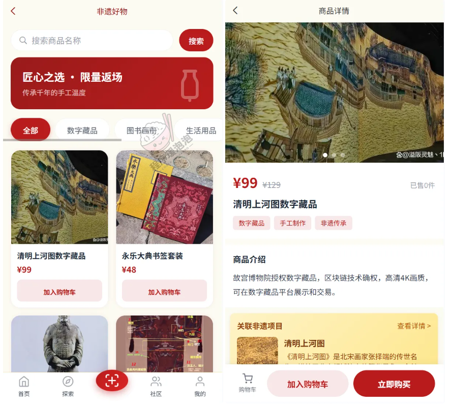

**图 4 · 非遗好物**：文创商城商品浏览。

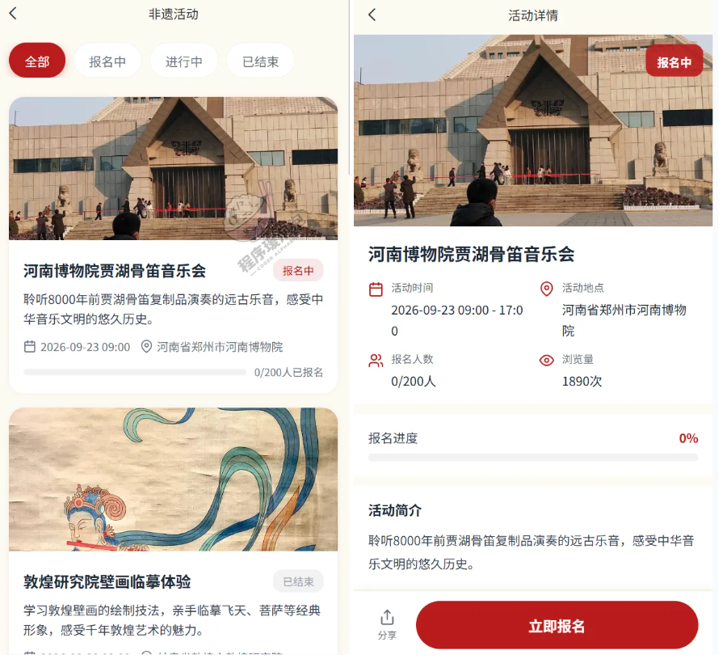

**图 5 · 非遗活动**：文化活动展示与报名入口。

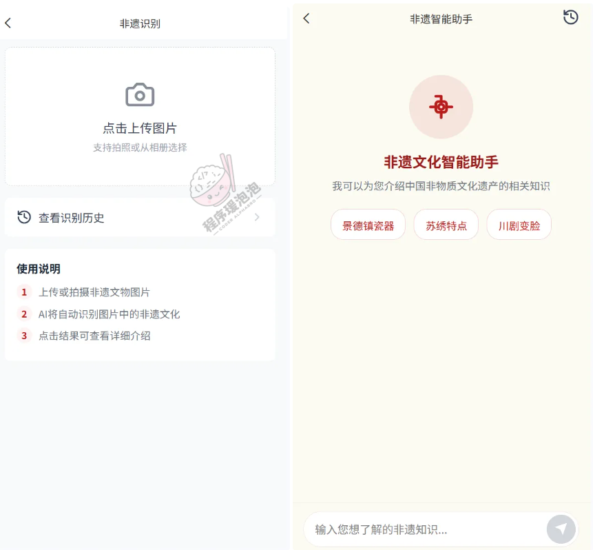

**图 6 · 非遗识别/AI问答**：ONNX 图像识别与 DeepSeek 智能问答入口。

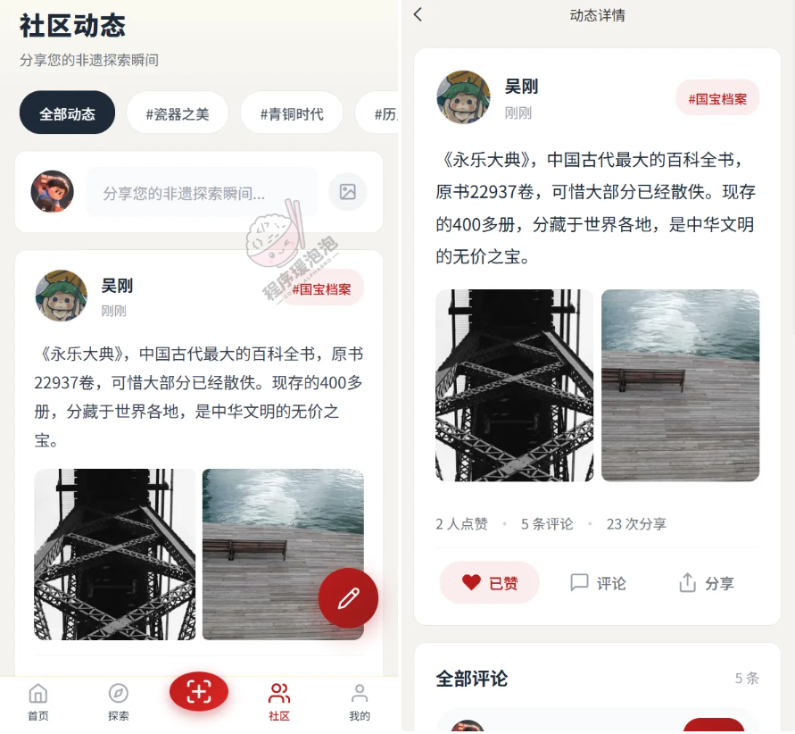

**图 7 · 社区动态**：社区话题动态流，支持评论点赞。

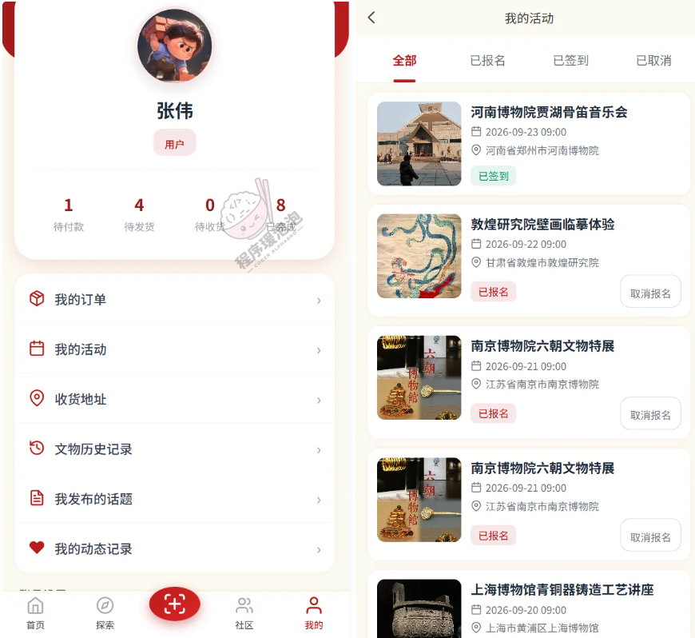

**图 8 · 个人中心**：个人收藏、浏览历史与账户设置。

### 4.2 管理员端

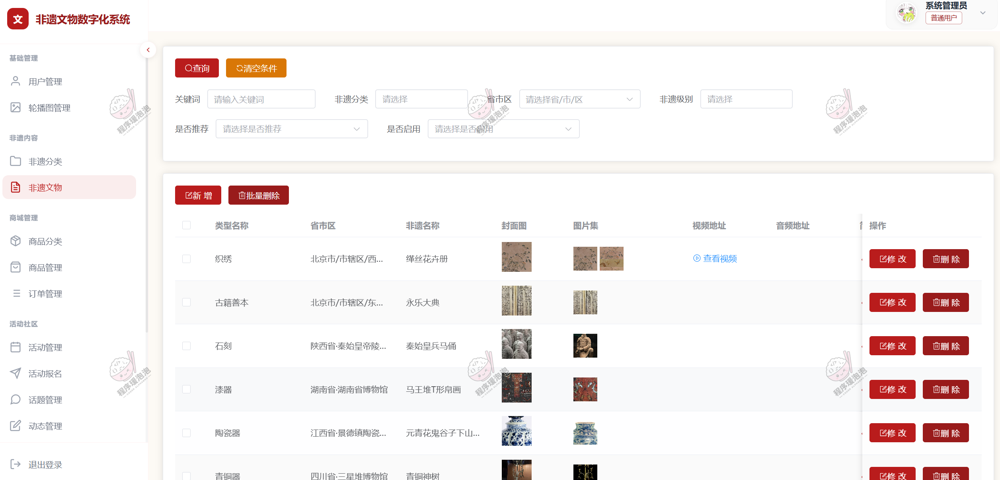

**图 9 · 非遗文物**：非遗项目管理与内容维护。

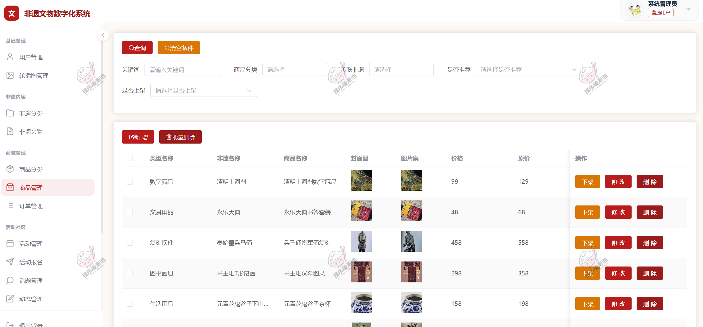

**图 10 · 商品管理**：文创商品维护与上下架。

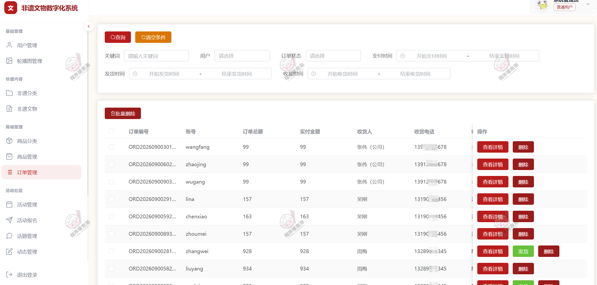

**图 11 · 订单管理**：订单查询与状态处理。

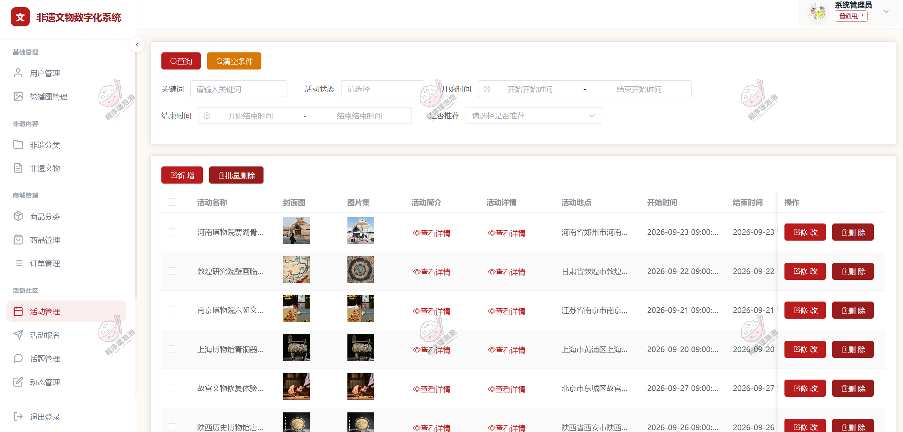

**图 12 · 活动管理**：文化活动发布与维护。

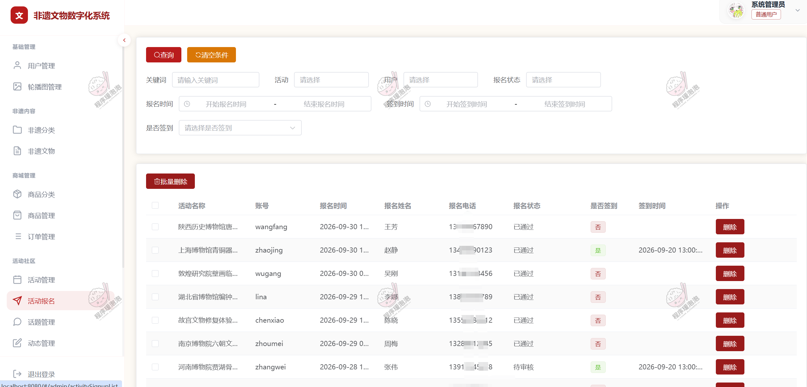

**图 13 · 活动报名**：活动报名记录与审核管理。

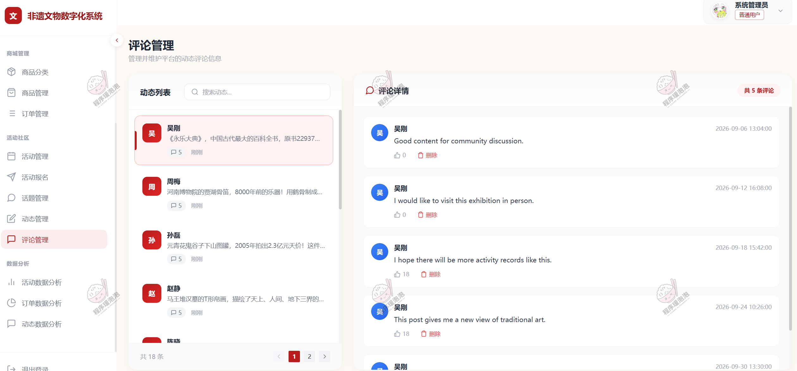

**图 14 · 评论管理**：社区评论与互动内容审核。

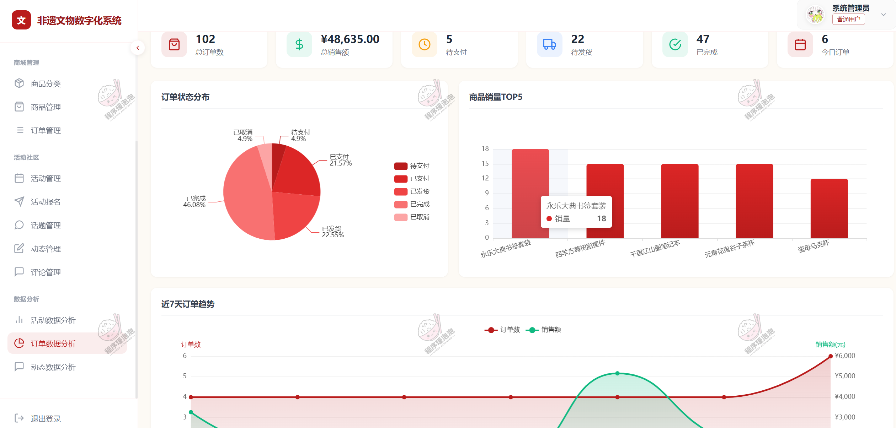

**图 15 · 订单分析**：经营数据看板与可视化分析。

## 说明

- 本文档中的界面截图均来自项目演示环境，仅用于功能展示与学习参考。
- 本项目仅用于学习交流，非开源、非无偿。
- 文档展示 15 张截图，需要了解更多，请联系我。
